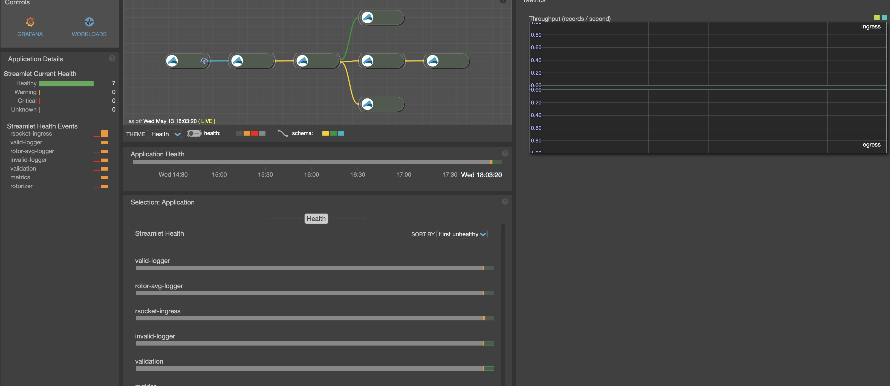

# RSocket Cloudflow Ingress

This repository is the companion code to the [article](https://www.lightbend.com/blog/implementing-rsocket-ingress-in-cloudflow-part-1-getting-started)

This project is based on the articles [RSocket Intro](https://www.baeldung.com/rsocket)
[Reactive Service-to-service](https://dzone.com/articles/reactive-service-to-service-communication-with-rso-1)
and [Reactor](https://www.baeldung.com/reactor-core) and cloudflow [sensor example](https://github.com/lightbend/cloudflow/tree/master/examples/snippets/modules/ROOT/examples/sensor-data-scala)
See also presentations [here](https://www.youtube.com/watch?v=QJ3xw0MF-3U&list=PLQ4mEUUwQwBoGe4UX5mVbsNkt7DPk03Dl)

The actual RSocket code is modeled after this [one](https://github.com/b3rnoulli/rsocket-examples) and this [one](https://github.com/rsocket/rsocket-java/tree/develop/rsocket-examples/src/main/java/io/rsocket/examples/transport/tcp)

## Project structure
Project contains several modules:
* `images` - contains images for this Readme
* `interactions` - initial experimentations with RSockets, based on this [code](https://github.com/b3rnoulli/rsocket-examples).
The examples here are:
    * [Fire and forget](interactions/src/main/scala/com/lightbend/rsocket/examples/FireAndForgetClient.scala) 
    demonstrates implementation of a simple fire and forget implementation
    * [Load balanced Fire and forget](interactions/src/main/scala/com/lightbend/rsocket/examples/Multiserver.scala) 
    demonstrates implementation of a loadbalancer for fire and forget implementation
    * [Request-stream](interactions/src/main/scala/com/lightbend/rsocket/examples/StreamingClient.scala) 
    demonstrates implementation of a back preasuured request stream implementation
    * [Channel](interactions/src/main/scala/com/lightbend/rsocket/examples/ChannelEchoClient.scala) 
    demonstrates implementation of a back preasuured channel implementation
* `support` is a shared project containing Avro definitions and shared transformation code
* `sensordata` is a cloudflow implementation for the [Sensor data Processing](https://cloudflow.io/docs/current/get-started/hello-world-example.html)
* `client` is an implementation of rsocket-based data provider for publishing sensor data.

## Cloudflow implementation

The idea behind the implementation is to replace HTTP Ingress from the original implementation with the RSocket ingress.
Three different ingress implementations are provided:
* Fire and forget JSON based ingress implemented by the [class](sensordata/src/main/scala/com/lightbend/sensordata/RSocketIngress.scala).
Here Rsocket `fire and forget` interactions are used, and sensor data is passed as text JSON.
* Fire and forget Avro based ingress implemented by the [class](sensordata/src/main/scala/com/lightbend/sensordata/RSocketBinaryIngress.scala).
Here Rsocket `fire and forget` interactions are used, and sensor data is passed as Avro encoded binary.
* Stream Avro based ingress implemented by the [class](sensordata/src/main/scala/com/lightbend/sensordata/RSocketStreamIngress.scala).
Here Rsocket `request-stream` interactions are used, and sensor data is passed as Avro encoded binary. 

Any of the implementations can be used. To pick the one that you want to use, go to [blueprint](sensordata/src/main/blueprint/blueprint.conf)
and uncomment the one that you want to experiment with.

To support these three interactions there are three data publishers:
* [JSON Fire and forget](client/src/main/scala/com/lightbend/sensordata/producer/rsocket/UTF8FireAndForget.scala)
* [Binary Fire and forget](client/src/main/scala/com/lightbend/sensordata/producer/rsocket/BinaryFireAndForget.scala)
* [Binary Streaming](client/src/main/scala/com/lightbend/sensordata/producer/rsocket/BinaryRequestStream.scala)

A class [Producer runner](client/src/main/scala/com/lightbend/sensordata/producer/rsocket/ProducerRunner.scala) is provided allowing to 
pick an individual publisher.

## Running locally

To run locally:
* Select a server configuration by uncommenting your selection in `sensordata/src/main/blueprint/blueprint.conf`
* Start Cloudflow implementation
  * `sbt runLocal`
* Tail log provided by a previous command
    * `tail -f ...`
* Run corresponding data provider.
    * in the [application config](client/src/main/resources/application.conf) set the required client
        * 1 for binary fire and forget producer
        * 2 for UTF8 fire and forget producer
        * 3 for binary streaming producer
    * Start [Producer runner](client/src/main/scala/com/lightbend/sensordata/producer/rsocket/ProducerRunner.scala) 
either directly from Intellij (with a corresponding option) or using the following command - `sbt "project client" run`

**Note:** You can also change the data publishing interval (default is 1000ms) by changing `producer.interval` value in [application config](client/src/main/resources/application.conf)

## Running on Kubernetes Cluster
Note: This example assumes that you already have CloudFlow deployed on a cluster, if you are not already familiar with 
deploying Cloudflow to a cluster it is recommended to complete this 
[tutorial](https://cloudflow.io/docs/current/get-started/index.html)

To run on a cluster (Assuming you have a Cloudflow instance deployed on it)
* Select an application configuration by uncommenting your selection in `sensordata/src/main/blueprint/blueprint.conf`
* Edit the file `target.env`
  * ensure that your `cloudflowDockerRegistry` is correct. A simplest way is to use (Docker hub)[https://hub.docker.com/]
* Publish an image to the docker registry:
  * First make sure that you have access to the cluster. Try to run `kubectl get nodes` to verify this 
  * Then publish `sbt buildAndPublish`
* Deploy the application to the cluster
  * Run  `kubectl cloudflow deploy docker.io/lightbend/sensordata:...`
  * Check the status with `get pods -n sensordata`
  * You can also go to enterprise console to make sure that the application is installed. You should see
  the picture similar to this . Note that there is no throughtput, because we are not publishing any data 
* Setup a local proxy to the ingress
  * Find the Pod name for the ingress `kubectl  get pods --all-namespaces | grep sensor-data-rsocket-ingress | awk '{ print $2 }'`
  * Create a proxy `kubectl port-forward <pod name> -n sensor-data 3000:3000`
* Run corresponding data provider
  * `sbt "project client" run`
  * Select the option corresponding to the option selected in the blueprint
  
Instead of setting up local proxy and connecting to the cluster from the local machine, you can also build
an image containing client and then deploy it to the cluster.
To do this, first execute the first 4 steps above.  
* Build client image
    * Run ` sbt docker` to build an image. This should create an image `lightbend/client:0.1`
* Push an image to the docker repository. In this example I am using docker hub `docker push lightbend/client:0.1`
* Deploy it to the cluster 
    * Validate service name and port by running `kubectl get service -n sensordata`
    * Update [deployment](install/client.yaml) to set required parameters
    * Deploy client by running `kubectl apply -f <your project location>install/client.yaml`